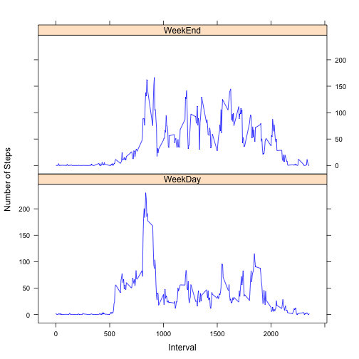

# Reproducible Research: Peer Assessment 1


## Loading and preprocessing the data


```r
library(lattice)
library(ggplot2)

setwd('/Users/fernando_perez/Documents/workspace_R/coursera/ReproducibleResearch/RepData_PeerAssessment1/')
Sys.setlocale("LC_TIME",locale="en_US")
```

```
## [1] "en_US"
```

```r
df <- read.csv(file='./activity.csv', 
               header=TRUE, 
               stringsAsFactors=FALSE)
```

**Note:** For this part of the study, missing values in the dataset are ignored.

## What is mean total number of steps taken per day?

Aggregate steps by date:


```r
stepsByDay <- aggregate(df[c("steps")], by=list(date=df$date), 
                        FUN=sum, na.rm=TRUE)
```

The following figure shows the histogram of the total number of steps taken 
each day


```r
histogram(stepsByDay$steps, breaks=10, xlab="Steps")
```

 


```r
mMean <- mean(stepsByDay$steps)
mMedian <- median(stepsByDay$steps)
```

Mean and Median of total number of steps taken per day:
- Mean = **9354.2295**
- Median = **10395**

## What is the average daily activity pattern?

Calculate the mean steps by day interval


```r
stepsByInterval <- aggregate(df[c("steps")], by=list(interval=df$interval), 
                             FUN=mean, na.rm=TRUE)

xyplot(steps ~ interval, data = stepsByInterval,type="l")
```

 


```r
mMax <- stepsByInterval[which.max(stepsByInterval$steps),"interval"]
```

The 5-minute interval, on average across all the days in the dataset, that contains the maximum number of steps is: **835**


**Note:** For the next part of the study, missing values   
are computed as the mean for the corresponding interval across entire dataset.

## Imputing missing values

Split source data into two different data frames  
One for the complete records and another one for the incomplete


```r
completeIdx <- complete.cases(df["steps"])

completeData    <- df[completeIdx,]
incompleteData  <- df[!completeIdx,]
incompleteLength <- dim(incompleteData)[1]
```

The total number of missing values in the dataset is: ***2304***

Fill incomplete values with the mean for that interval  
Merging incomplete data frame with means by interval data frame


```r
fillIncomplete <- merge(x=incompleteData,
                        y=stepsByInterval,
                        by="interval")

inferencedData<- fillIncomplete[c("steps.y", "date", "interval")]
colnames(inferencedData) <- colnames(completeData)
```

Join the complete cases with the inferenced cases to  
create a new dataset that is equal to the original dataset  
but with the missing data filled in


```r
df2 <- rbind(completeData, inferencedData)
```

Histogram of the total number of steps taken each day


```r
stepsByDay2 <- aggregate(df2[c("steps")], by=list(date=df2$date), FUN=sum, na.rm=TRUE)
histogram(stepsByDay2$steps,breaks=10, xlab="Steps")
```

 


```r
mMean2   <- mean(stepsByDay2$steps)
mMedian2 <- median(stepsByDay2$steps)
```

Mean and Median of total number of steps taken per day:
- Mean filling NA = **1.0766 &times; 10<sup>4</sup>** vs Mean without NAs = **9354.2295**
- Median filling NA= **1.0766 &times; 10<sup>4</sup>** vs Median without NAs = **10395**


## Are there differences in activity patterns between weekdays and weekends?

Following code create a factor variable (daytype) in the dataset with two levels  
“weekday” and “weekend” indicating whether a given date is a weekday or weekend day.  


```r
df2["daytype"] <- factor(weekdays(strptime(df2$date,format="%Y-%m-%d")) %in% c('Sunday','Saturday'),
                         labels=c("WeekDay","WeekEnd"),
                         levels=c("FALSE","TRUE"))
```

Calculate the mean steps by daytype


```r
stepsByInt_DayType <- aggregate(df2[c("steps")], 
                                by=list(daytype = df2$daytype, interval=df2$interval), 
                                FUN=mean, na.rm=TRUE)
```

The following plot contains a time series plot of the 5-minute interval (x-axis)  
and the average number of steps taken, 
averaged across all weekday days or weekend days (y-axis).


```r
xyplot(steps ~ interval|daytype, data = stepsByInt_DayType,
       type="l",
       col="blue",
       main="Day Type",
       xlab="Interval",
       ylab="Number of Steps")
```

 
